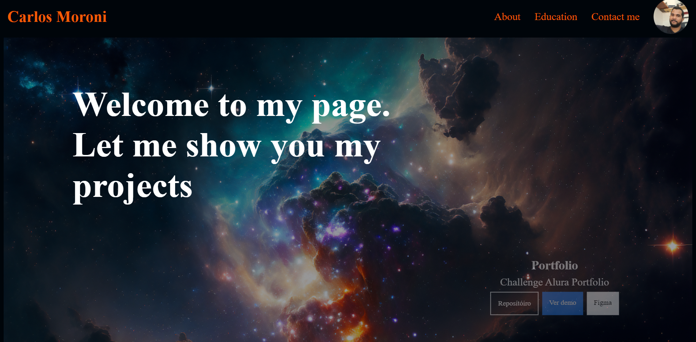

# Portfólio Pessoal


[]([(https://portfolio-carlosgarcias-projects.vercel.app/)])

## Este projeto é um portfólio pessoal desenvolvido como parte do curso da Alura. 
O portfólio apresenta informações sobre mim, meus projetos, habilidades e formas de contato.

## Agradecimentos 

 Já no início, gostaria de agradecer à Alura pelos excelentes cursos que me proporcionaram o conhecimento necessário para desenvolver este portfólio. Agradeço também a todos os instrutores e colegas de curso pelo apoio e colaboração ao longo do aprendizado.

## Funcionalidades
- **Imagem de destaque do projeto**: A imagem que se vê acima.
- **Botões para saber mais**: Botões que direcionam para o repositório, uma demonstração e o breefingno figma.
- **Seção Sobre Mim**: Uma pequena seção onde falo sobre a minha pessoa.
- **Seção de Projetos**: Uma área para exibir meus projetos.
- **Seção de Habilidades**: Uma parte para soft e hard skils, também hobbies.
- **Formulário de Contato**: Um formulário de contato estilizado.

## Se você tiver alguma dúvida ou sugestão, sinta-se à vontade para entrar em contato:

- **Email**: carlosmoronisud@gmail.com
- **Linkedin**: https://www.linkedin.com/in/carlosmoronigarcia

## Tecnologias Utilizadas

- HTML5
- CSS3
- JavaScript


## Como Usar

1. Clone este repositório para o seu ambiente local:
    ```bash
    git clone https://github.com/carlosmoronisud/portfolio
    ```

2. Navegue até o diretório do projeto:
    ```bash
    cd https://github.com/carlosmoronisud/portfolio/tree/main
    ```

3. Abra o arquivo `index.html` no seu navegador preferido para visualizar o portfólio.

## Estrutura do Projeto

```plaintext
.
├── index.html       # Página principal do portfólio
├── styles.css       # Arquivo de estilos CSS
├── script.js        # Arquivo de scripts JavaScript
├── images/          # Diretório com imagens usadas no portfólio
└── README.md        # Este arquivo


